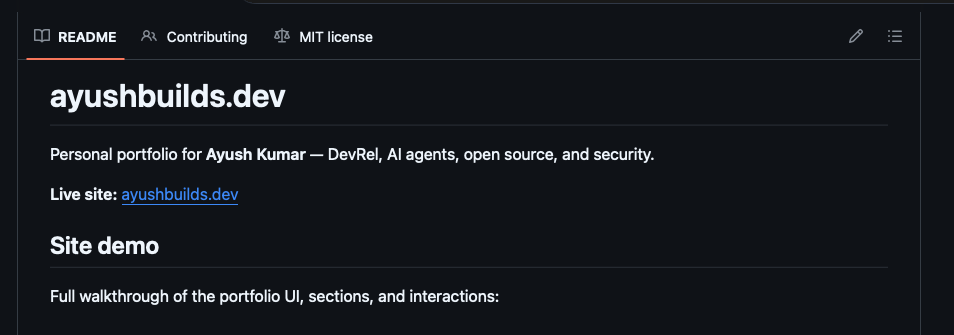

# ayushbuilds.dev

Personal portfolio for **Ayush Kumar** — DevRel, AI agents, open source, and security.

**Live site:** [ayushbuilds-dev.vercel.app](https://ayushbuilds-dev.vercel.app/)

## Site demo

Full walkthrough of the portfolio UI, sections, and interactions.

> GitHub does not render `<video>` tags in README files. Use the preview below or the links to watch the demo.

[](https://github.com/Ayush7614/ayushbuilds.dev/blob/master/docs/site-demo.mp4)

**Watch:** [Open demo video on GitHub](https://github.com/Ayush7614/ayushbuilds.dev/blob/master/docs/site-demo.mp4) · [Download MP4](https://github.com/Ayush7614/ayushbuilds.dev/raw/master/docs/site-demo.mp4)

## Stack

- [Next.js](https://nextjs.org) 16 (App Router)
- TypeScript
- Tailwind CSS v4
- Framer Motion

## Development

```bash
npm install
npm run dev
```

Open [http://localhost:3000](http://localhost:3000).

## Customize

- **Blog URL**: set `site.blogUrl` in `src/lib/data.ts` when ready.
- **Content**: edit `src/lib/data.ts` for experience, projects, and links.
- **Profile image**: replace `public/profile.png`.

## Deploy

Deployed on [Vercel](https://vercel.com). Custom domain `ayushbuilds.dev` can be added in project settings when ready.

```bash
npm run build
```
